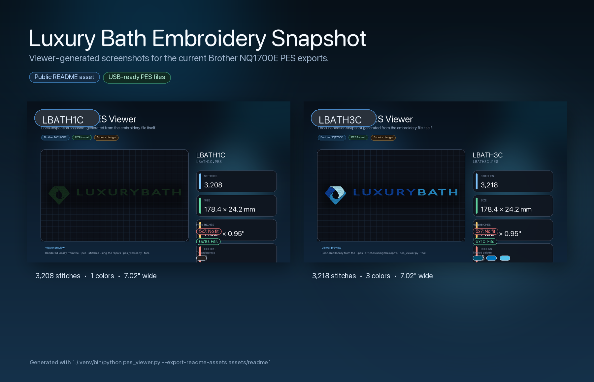
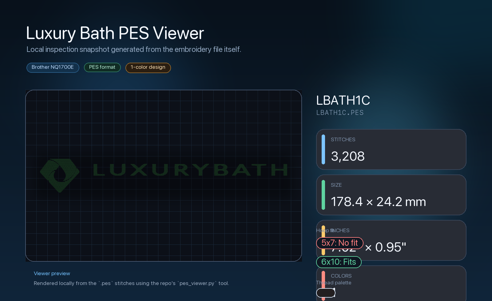
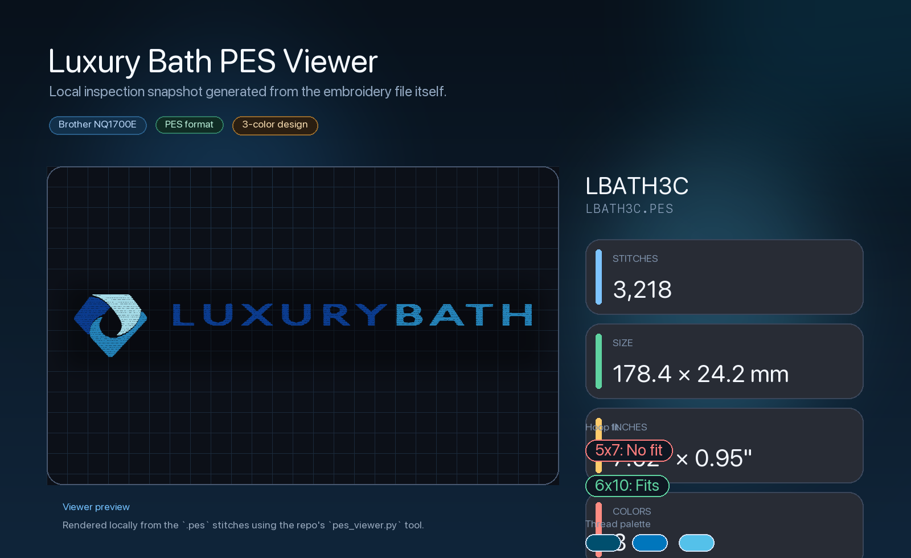

<div align="center">
  
  <h1>Luxury Bath Embroidery Files</h1>
  <p><strong>Brother NQ1700E-ready PES exports, source artwork, and local review tooling for the Luxury Bath logo embroidery project.</strong></p>
</div>

## At A Glance

| Item | Details |
| --- | --- |
| Purpose | Review, share, regenerate, and USB-load the current Luxury Bath embroidery files |
| Target machine | Brother `NQ1700E` |
| Machine format | `PES` |
| Current size | `178.4 mm x 24.2 mm` |
| Current size in inches | `7.02" x 0.95"` |
| Hoop fit | Fits `6x10`, does not fit `5x7` |
| Included machine files | `LBATH1C.PES`, `LBATH3C.PES` |

> [!IMPORTANT]
> The current exports are oversized for a typical left-chest logo. These files are about `7.02"` wide and are better suited to a larger horizontal placement unless they are resized and re-digitized.

## PES Viewer Screenshots

<table>
  <tr>
    <td width="50%" valign="top">
      
      <p><strong>LBATH1C.PES</strong><br>1 color • 3,208 stitches • fits 6x10 only</p>
    </td>
    <td width="50%" valign="top">
      
      <p><strong>LBATH3C.PES</strong><br>3 colors • 3,218 stitches • fits 6x10 only</p>
    </td>
  </tr>
</table>

These screenshots were generated with the local `pes_viewer.py` tool from the actual `PES` files in this repository.

## What These Files Are For

This repo is the working handoff package for the current Luxury Bath embroidery set. It exists so the files can be:

- checked visually before stitch-out
- copied onto a USB drive for the embroidery machine
- emailed to vendors or collaborators
- regenerated from the supplied vector artwork when size or stitch settings change

The current stitched design uses:

- the Luxury Bath icon
- the `LUXURY BATH` wordmark

The current stitched design omits:

- `BY BATH CONCEPTS`

The byline was left out because it becomes too small to sew cleanly at compact embroidery sizes in this horizontal layout.

## Primary Deliverables

### Machine files

- `LBATH1C.PES`
  - single-color version
  - about `3208` stitches
- `LBATH3C.PES`
  - three-color version
  - about `3218` stitches

### Editable and review files

- `luxbath_leftchest_1c.svg`
- `luxbath_leftchest_3c.svg`
- `previews/LBATH1C_preview.png`
- `previews/LBATH3C_preview.png`
- `export/`

## USB Workflow For The Brother NQ1700E

1. Format a real USB flash drive as `FAT32`.
2. Copy `LBATH1C.PES` and/or `LBATH3C.PES` to the USB root or a single top-level folder.
3. Keep the drive clean and avoid deeply nested folders.
4. Insert the USB drive into the Brother `NQ1700E`.
5. Load the design from the machine's USB menu.

## Source Artwork In This Repo

- `LuxuryBath-bybc-black-horizontal.eps`
- `LuxuryBath-bybc-black-vertical.eps`
- `LuxuryBath-bybc-pantone-coated-horizontal.eps`
- `LuxuryBath-final-pantone-coated-vertical.eps`
- `luxury-bath-standards-final-v3 25.pdf`

## Local PES Viewer

Inspect one or more `PES` files:

```bash
./.venv/bin/python pes_viewer.py --info LBATH1C.PES LBATH3C.PES
```

Open the local browser-based viewer:

```bash
./Open\ PES\ Viewer.command
```

Export the README screenshot assets again:

```bash
./.venv/bin/python pes_viewer.py LBATH1C.PES LBATH3C.PES --export-readme-assets assets/readme
```

The local viewer reports:

- stitch count
- color count
- design width and height
- inch conversion
- hoop fit for `5x7` and `6x10`

## Regenerating The Embroidery Files

The generator workflow assumes:

- Inkscape installed
- Ink/Stitch available
- the local Python virtual environment in `.venv`

Regenerate the SVG and `PES` outputs with:

```bash
source .venv/bin/activate
python make_luxbath_embroidery.py
```

## Repo Notes

- `export/` is the quick-send folder for emailing the key outputs.
- `assets/readme/` contains viewer-generated screenshots used in this README.
- This repo tracks the current embroidery working set, not the master brand system.
