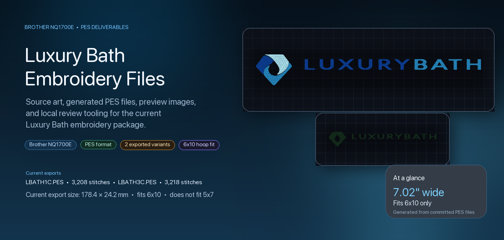
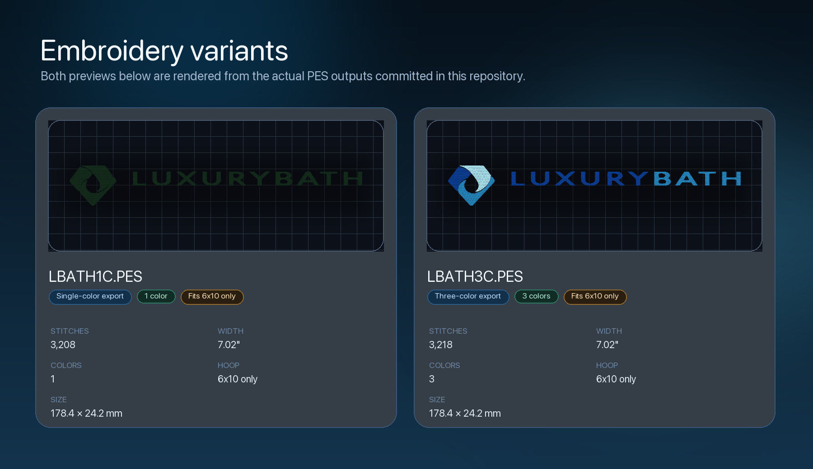
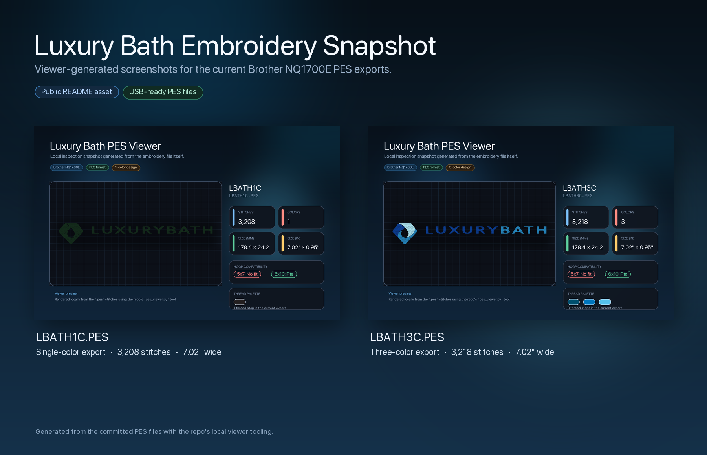

<div align="center">
  
  <h1>Luxury Bath Embroidery Files</h1>
  <p><strong>Machine-ready PES exports, source artwork, preview assets, and local review tooling for the current Luxury Bath embroidery package.</strong></p>
</div>

<p align="center">
  
  
  
  
  
  
</p>

<p align="center">
  <a href="#use-these-files-first">Use these files first</a> •
  <a href="#quick-start">Quick start</a> •
  <a href="#preview-gallery">Preview gallery</a> •
  <a href="#machine-compatibility">Compatibility</a> •
  <a href="#preview-files-locally">Preview locally</a> •
  <a href="#regenerate-the-outputs">Regenerate</a>
</p>

> [!IMPORTANT]
> The current exports are about `178.4 mm × 24.2 mm` (`7.02" × 0.95"`). They fit a Brother `6x10` hoop and do **not** fit a `5x7` hoop in their present form.

## What This Repo Is

This repository is a clean public handoff package for the current Luxury Bath embroidery deliverables.

It exists to keep the working set in one place:

- source artwork for reference and regeneration
- machine-ready `PES` files for the Brother `NQ1700E`
- preview images so the files can be reviewed before stitch-out
- a lightweight local viewer for checking size, stitch count, and hoop fit
- an email-ready `export/` folder for fast sharing

This is a design-deliverables repo, not a software product. The goal is clarity, portability, and trustworthy documentation around the files that actually ship.

## Use These Files First

> [!TIP]
> If you only need the embroidery files, start with [`LBATH1C.PES`](LBATH1C.PES) or [`LBATH3C.PES`](LBATH3C.PES). The [`export/`](export) folder contains the same key outputs bundled for sending.

| File | Purpose | Notes |
| --- | --- | --- |
| [`LBATH1C.PES`](LBATH1C.PES) | Single-color machine file | `3208` stitches, `178.4 × 24.2 mm`, fits `6x10` only |
| [`LBATH3C.PES`](LBATH3C.PES) | Three-color machine file | `3218` stitches, `178.4 × 24.2 mm`, fits `6x10` only |
| [`luxbath_leftchest_1c.svg`](luxbath_leftchest_1c.svg) | Editable working SVG | Source for the current 1-color embroidery export |
| [`luxbath_leftchest_3c.svg`](luxbath_leftchest_3c.svg) | Editable working SVG | Source for the current 3-color embroidery export |
| [`export/`](export) | Email-ready bundle | Includes `PES`, `SVG`, and preview PNG copies |

## Preview Gallery



Both previews above are rendered from the actual committed `PES` files, not mocked-up embroidery visuals.

## Quick Start

1. Choose [`LBATH1C.PES`](LBATH1C.PES) for the single-color version or [`LBATH3C.PES`](LBATH3C.PES) for the three-color version.
2. Copy the selected file to a real `FAT32` USB drive.
3. Keep the file in the USB root or a single top-level folder.
4. Insert the USB drive into the Brother `NQ1700E`.
5. Load the design from the machine's USB menu.

## Machine Compatibility

| Item | Current value |
| --- | --- |
| Target machine | Brother `NQ1700E` |
| Machine file format | `PES` |
| Current design size | `178.4 mm × 24.2 mm` |
| Current design size in inches | `7.02" × 0.95"` |
| `5x7` hoop | No |
| `6x10` hoop | Yes |
| USB guidance | `FAT32`, simple filenames, avoid deep folder nesting |

## Why These Files Look The Way They Do

The current exported files use:

- the Luxury Bath icon
- the `LUXURY BATH` wordmark

The current exported files do not include:

- `BY BATH CONCEPTS`

That byline was omitted from the embroidery outputs because it becomes too small to sew cleanly in the horizontal lockup at compact embroidery sizes. The source artwork is still included in the repo for reference.

## Repo Structure

```text
.
├── LBATH1C.PES
├── LBATH3C.PES
├── luxbath_leftchest_1c.svg
├── luxbath_leftchest_3c.svg
├── make_luxbath_embroidery.py
├── make_readme_assets.py
├── pes_viewer.py
├── Open PES Viewer.command
├── README.assets/
│   ├── hero-banner.png
│   ├── stitch-gallery.png
│   └── viewer_overview.png
├── previews/
│   ├── LBATH1C_preview.png
│   └── LBATH3C_preview.png
├── export/
│   ├── LBATH1C.PES
│   ├── LBATH3C.PES
│   ├── luxbath_leftchest_1c.svg
│   ├── luxbath_leftchest_3c.svg
│   └── EXPORT_NOTES.txt
└── source artwork
    ├── LuxuryBath-bybc-black-horizontal.eps
    ├── LuxuryBath-bybc-black-vertical.eps
    ├── LuxuryBath-bybc-pantone-coated-horizontal.eps
    ├── LuxuryBath-final-pantone-coated-vertical.eps
    └── luxury-bath-standards-final-v3 25.pdf
```

## Preview Files Locally

Use the local viewer if you want a quick inspection without separate embroidery software.

```bash
./.venv/bin/python pes_viewer.py --info LBATH1C.PES LBATH3C.PES
```

Open the browser-based local viewer on macOS:

```bash
./Open\ PES\ Viewer.command
```

The viewer reports:

- stitch count
- color count
- size in millimeters and inches
- hoop fit for `5x7` and `6x10`



## Regenerate The Outputs

### Embroidery outputs

Prerequisites assumed by the current workflow:

- Inkscape installed
- Ink/Stitch available
- local Python environment in `.venv`

Regenerate the working SVG, `PES`, and preview PNG files:

```bash
source .venv/bin/activate
python make_luxbath_embroidery.py
```

### README visuals

Regenerate the landing-page assets from the current committed files:

```bash
source .venv/bin/activate
python make_readme_assets.py
```

## Design Notes And Limitations

- The current `PES` files are wide horizontal exports and are larger than a typical left-chest treatment.
- The local viewer is useful for review, but it is not a substitute for a real sew-out on target fabric.
- The repo is meant to track the current embroidery package, not to replace the original brand system of record.
- The README visuals are generated from real repo assets and committed files; they are not simulated product mockups.

## FAQ

<details>
<summary><strong>Which file should I use?</strong></summary>

Use [`LBATH1C.PES`](LBATH1C.PES) for the single-color version and [`LBATH3C.PES`](LBATH3C.PES) for the three-color version.

</details>

<details>
<summary><strong>Why doesn't this fit a 5x7 hoop?</strong></summary>

The current exports are about `178.4 mm` wide, which exceeds the usable width for a `5x7` hoop. The committed files fit `6x10` only in their present form.

</details>

<details>
<summary><strong>Can I inspect these files without embroidery software?</strong></summary>

Yes. Use [`pes_viewer.py`](pes_viewer.py) or [`Open PES Viewer.command`](Open%20PES%20Viewer.command) to review stitch count, size, and hoop fit locally.

</details>

<details>
<summary><strong>How do I refresh the README images after changing files?</strong></summary>

Run:

```bash
source .venv/bin/activate
python make_readme_assets.py
```

</details>

## Maintenance

This repo is intentionally small and shareable. If you change the generator, the source artwork workflow, or the committed `PES` outputs, regenerate the previews and README visuals so the landing page stays accurate.

See [`CONTRIBUTING.md`](CONTRIBUTING.md) for lightweight maintenance expectations.
